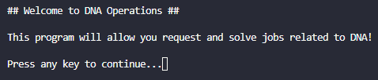
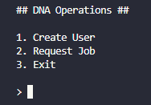
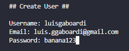
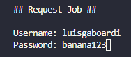
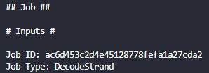
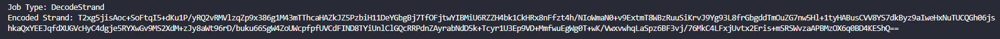
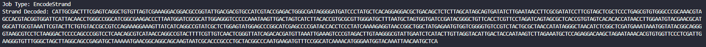
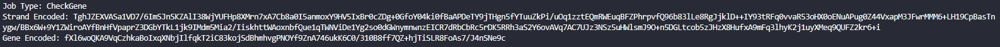
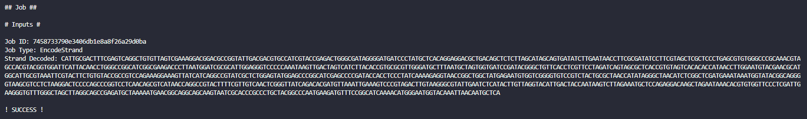
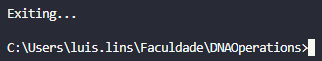

# Quick Start

## How to Run

1. Download the repository as a Zip or clone it to your machine using the following commandin the terminal:

` git clone https://github.com/luisgaboardi/LacunaGeneticsAdmission`

2. Access the project's folder with the command:

`cd LacunaGeneticsAdmission/src`

3. Execute the project with:

`dotnet run`

## Usage

1. The first thing you'll see is the welcome message, which can be skipped by pressing any key:

2. This is the main menu. It has 3 possible actions, that can be chosen by typing the number before it and press enter:
   - Create a user in the Lacuna API;
   - Request a job from the API
   - Close the Program

3. Creating a User

> You can skip this section if you have already created a user

This screen will ask for a username, a email and a password, to register a new user to the Lacuna API.

4. Request a Job

   4.1. In this step, the system need the credentials of a valid user to request a job from the API:

   

   4.2. If the request was successfull, the job's description will be shown, with the following base informations:

   

   4.3. Every type of job have this attributes, but as descripted in the challenge presentation, there are 3 types of jobs:
   - Decode strand
   - Encode strand
   - Check if gene is activated in a strand
   
   Each job has the respective data required to solve it, as shown below:

   
   
   

   4.4. The job will be automatically solved and it's result sent to the Lacuna API, that will answer if the data processing returned the correctly of not, with a message such as:

   

   4.5. You will be sent back to the main menu, where you can require another job.

5. The exit option closes the program gracefully.

## History

| Version | Description                                               | Date       |
| ------- | --------------------------------------------------------- | ---------- |
| 1.0     | Created file with the instructions to execute the program | 09/05/2023 |
