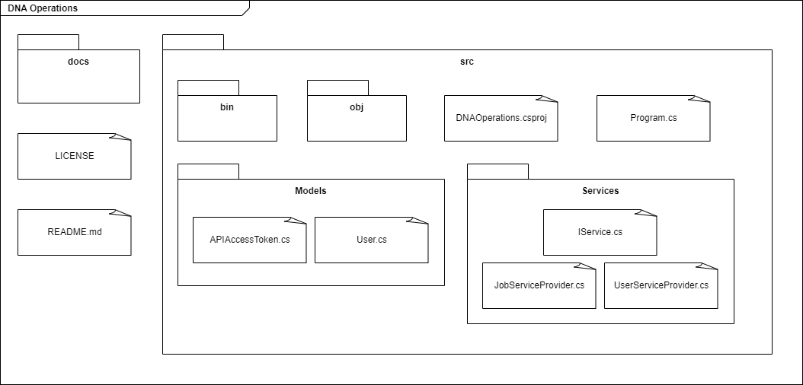

# Software Architecture

## Description

Initially, the project was to be developed according to the concepts of the MVC architecture; however, due to the low complexity of the solution, it was decided to use a less rigorously defined architecture. Below are some artifacts and their explanations:

## Package Diagram

The package diagram shows the main packages of the project, which are:

* **docs** contains the documentation of the project, such as this file;
* **bin, obj, DNAOperations.csproj, Program.cs** are files generated by the .NET Core SDK, the last being the main file of the project;
* **Models** contains the classes that represent the data that will be used in the project, such as the user and the AccessToken;
* **Services** contains the classes that will be responsible for the communication with the Lacuna API, such as the UserServiceProvider, the JobServiceProvider and the Service base interface named IService;

## History

| Version | Description                         | Date       |
| ------- | ----------------------------------- | ---------- |
| 0.1     | Created file                        | 04/05/2023 |
| 0.2     | Add description and package diagram | 10/05/2023 |
